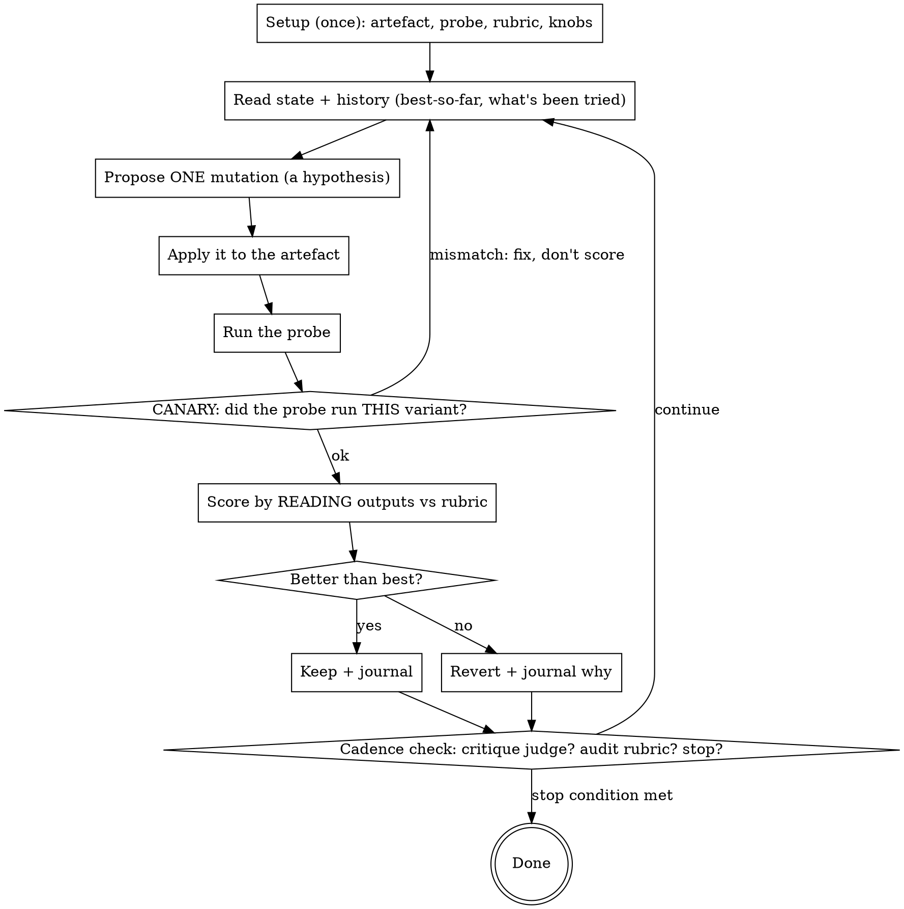

# betterbest

**You've got good. Go for best.** Polish and improve just about anything, from code to prose.

betterbest is a **general-purpose adaptation of autoresearch**: you improve a *thing* by running
**iterative experiments** on it. One experiment = change one thing, run a probe, read the result,
keep it if better or revert if not. Repeat until the thing is as good as it can be.

It works on anything you can **inspect, change, and measure**: a prompt, a config, a function, an
agent system, an essay, a recipe, a melody, a policy doc, a UI flow. The thing only has to be
*good enough to start* — betterbest refines what exists, it does not generate from nothing.

## The mapping (this is the whole idea)

| Piece | What it is | Examples |
|---|---|---|
| **Artefact** | the thing you're improving (inspectable, mutable, versionable) | `prompt.txt`, a function, `speech.md`, a recipe |
| **Experiment** | one change → run probe → read → keep/revert | the loop body |
| **Probe** | whatever *exercises* the artefact and yields something to read | test questions at a prompt; tests+profile for code; a critic-persona panel for prose (see *Working on prose*) |
| **Rubric** | the weighted dimensions you read each result against, each tagged **hard gate or soft penalty**; each dimension's scorer can be a formula OR a subagent evaluation — same interface, just a weighted term | `+5 cites source / −50 hallucination / −20 cost`; or `+30 "a fresh critic judges clarity"` |
| **Journal** | the running record of every experiment and verdict | `scripts/journal.py` |

## The loop

## Setup interview (do this once, with AskUserQuestion cards)

Before iterating, settle these. Use `AskUserQuestion` for the multiple-choice knobs; ask
free-form for the artefact/probe/rubric. Don't start the loop until they're set.

1. **Artefact** — what file/thing are we improving? (must be inspectable, mutable, versionable —
   put it under git so each experiment is a revertible commit)
2. **Probe** — what command/process exercises it and produces something readable? It must be
   *deterministic enough* to compare two runs, *cheap enough* to run every iteration, and
   **FIXED across the run** (changing the probe mid-run destroys comparability).
3. **Rubric** — the weighted dimensions, with concrete pass/fail criteria and a **cost term**.
   For EACH term, DECLARE its status: a **hard gate** (violating its cap/constraint caps the score —
   the variant fails regardless of the numeric total) or a **soft penalty** (nets into the total).
   The numeric total alone must NEVER override a hard gate: a variant that totals high but violates a
   hard gate is a revert, not a keep. An undeclared term defaults to soft penalty, so any
   must-not-violate constraint MUST be declared a hard gate explicitly.
   A hard gate must be **binary at judging time**. If its dimension is graded (0–10 / 0–N)
   rather than already pass/fail, declare the **gate threshold at setup**: the score below which
   the variant fails outright (e.g. 'honesty is a gate with threshold 8 → honesty ≤ 7 fails,
   regardless of total'). State the threshold and its direction (floor vs ceiling) when you
   declare the gate; an undeclared threshold means the dimension is a soft penalty, not a gate.
   Fix the threshold for the run — moving it to rescue a variant is rubric-gaming (only the
   rubric audit, anchored to the original goal, may revise it, and then you re-score recent
   iterations against the new threshold).
   Weights reflect the real cost of each failure (a hallucination ≫ verbosity; a leak may be P0).
4. **Rubric-review mode** (card) — how is the rubric itself audited as you learn?
   - **Human-in-the-loop** — every N iters, show the user the current best + recent verdicts, ask them to confirm/adjust weights.
   - **Subagent auditor** — a fresh subagent anchored to the ORIGINAL goal audits the rubric, proposes revisions.
   - **Skip** — fixed rubric, no audit (fastest; risks optimizing the wrong thing).
5. **Stopping condition** (card) — **plateau** (stop after K kept-nothing iterations) and/or
   **fixed budget** (stop after N iterations). Track both.

No user to interview (autonomous run)? Don't block — choose the defaults (subagent-auditor review mode; plateau K=5-8 and budget N per the sizing guidance), record each choice in the journal as an explicit assumption to revisit, and start the loop. The rubric audit is where wrong guesses surface and get corrected.

## The disciplines that actually need holding

A capable agent already proposes one change at a time, applies the loop to non-code things,
audits a gamed rubric, and stops on a plateau — when a single clean task is in front of it. The
value of betterbest is keeping that alive across a **long, real run**, plus these things that are
easy to drop:

### 1. Judge by READING — never by regex
The rubric verdict comes from *you reading the output* and deciding. Mechanical checks
(grep, a count, a format match) are **hints to look at, never the score**. Regex misses
paraphrase, tone, partial leaks, and every subjective dimension; it burns the rubric's dynamic
range on false positives. `scripts/judge_helper.py` renders a worksheet you fill in by reading;
it deliberately does no scoring. Even for a "fully specified" literal (an ID, a banned word),
the grep is a *pre-filter* — you still read the flagged item to render the verdict.

### 2. Run the CANARY every iteration
The silent failure: you believe you tested variant v14, but a stale path / cached config /
un-applied edit means the probe ran v12. The score looks fine; it's measuring the wrong thing,
and every later experiment builds on a phantom. **Before trusting any score**, verify the
running config matches the declared variant — compare a declared property (a planted marker, the
model id, the file hash) against what actually appears in the probe output. (Prose has no hash —
see *Working on prose* for its canary form.) `scripts/canary.py` does this and exits loud on
mismatch. On mismatch: do NOT log; fix the apply/probe path; re-run. This is cheap; run it
*every* time, not just when suspicious.

### 3. Critique the judge for drift (the judge is YOU)
Over a long run you anchor on your own prior verdicts and scores creep upward — the same output
you'd have scored 6 at iteration 3 you wave through as an 8 at iteration 25. Every **5–7
iterations**, spawn a *fresh* subagent with no loop context. Give it the rubric and a sample of
recent outputs cold, and ask: were these scored consistently and correctly? Journal its findings.
When it disagrees, either justify your score or revise it — both are useful. A single-shot run
never reveals this; a real run always does.

### 4. Let the rubric CO-EVOLVE (on your chosen cadence)
Early experiments expose flaws in the rubric itself: a reward being gamed, a dimension that never
fires, a penalty too weak to matter, two dimensions double-counting. On the rubric-review cadence
from setup, step out of optimization mode and ask: *is the rubric still measuring what we care
about?* When you revise it, journal the revision and **re-score recent iterations against the new
rubric** (you trade away comparability with older scores — that's the cost of not optimizing the
wrong thing for 50 iterations).

**The audit can change the judges, not just the weights.** A dimension's scorer can be a formula
or a subagent, so the audit revises both: re-weight, add, or drop dimensions **and swap a
dimension's implementation** — replace a formula with a fresh critic, or split a vague
subagent-judge into two sharper ones. Adding or removing a judge from a panel *is* adding or
removing a weighted dimension; no separate machinery. The same anti-gaming guard applies: the
audit is anchored to the original goal (a fresh goal-anchored agent or the human), so judges
change only to measure the goal *better*, never to pick a more lenient referee — swapping in a
friendlier judge is just rubric-gaming one level up.

**Re-anchor `best` after a revision — don't keep climbing the old hill.** The old rubric is what
crowned the current `best`, and it's the thing you just decided you couldn't trust. So re-scoring
isn't bookkeeping; it can change *which variant you continue from*. Re-score recent iterations —
**including ones you REVERTED** — under the new rubric, because a rubric change is exactly what
resurrects a variant the old metric undervalued. Pick the new `best` from those re-scored results
and continue from it. Bound "recent" to keep it cheap, and treat anything older than the last
rubric change (or older than a canary fix) as suspect rather than re-scoring the whole history.

If an audit confirms the rubric is sound and you've plateaued, that's a real stop, not a reason
to grind.

## Keep or revert?

The core decision of every experiment. Apply these in order — **any one can force a revert**:

1. **Hard gate** — does the variant violate a term declared a gate (overclaim, failing test, leak)?
   Revert, regardless of how high the total is. A gate is dispositive.
2. **Dominance, dimension by dimension (never the scalar total)** — re-read best vs variant per
   dimension. Keep requires BOTH: no already-kept dimension worse in meaning (revert if so, even if
   the total rose), AND at least one improved dimension whose gain clears that dimension's own noise
   band — the spread from re-running the unchanged best 3–5× on a stochastic probe (skip the band on
   a deterministic probe: any gain counts, jitter is a canary failure). All up dimensions inside-band
   → unproven wash → revert. Any up dimension at the band edge → escalate to step 3 for a
   blind re-judge on that dimension.
3. **Independent confirmation (run it, don't gesture).** Reached only for the edge dimension from step 2.
   The critic that set the band also judged the gain, so it has no independent backing. Run exactly
   **one fresh critic** — a blind held-out re-judge that did not generate the variance and isn't
   told which variant is incumbent. Give it best and candidate unlabelled, same rubric (soft terms
   only — gates settled in step 1), and ask which is better *on that dimension* and by how much. **Keep** only if it
   picks the candidate *and* by a margin clearing the band; otherwise **revert** — disagreement, a
   wash, or a sub-band margin all hold the incumbent. The re-judge is a tie-breaker, not a co-equal
   vote: a panel-keep never survives a re-judge-revert. Don't convene a third critic to break a
   split — "best of three" is shopping for a friendlier referee. Journal both verdicts. A re-judge
   can overturn an edge revert this way, never a gate.

## Practicalities (scale, defaults)

- **Reading at scale.** Read every item while the probe is small (≤~20). For a large probe, read
  a fixed sample plus *every* item a hint flagged, and journal that you sampled (don't silently
  cap coverage). Never swap reading for a mechanical aggregate.
- **Sizing the knobs.** Reasonable defaults: plateau **K = 5–8** kept-nothing iterations; budget
  **N** scaled to cost. The cost-vs-quality exchange rate is yours to set (the rubric audit
  calibrates it).

## Working on prose (and other non-code artefacts)

Every code-specific ritual has a prose form. Collected here so it's one place, not scattered:

- **Probe** = a verification *panel* in place of compile/test: (a) critic personas (skeptic,
  target reader, domain expert) reacting in-character, (b) a read-aloud/cadence pass for clunky or
  unsayable lines, (c) a hard-constraint check (length, banned words, required claims, tone).
- **Canary** = confirm the critics quote or react to a distinctive phrase from the edit you just
  made (the prose has no file hash to compare) — proof they read *this* draft, not a stale paste.
- **Keep/revert** = the panel jitters, so apply the ordered *Keep or revert?* checklist above
  (hard gate → dominance/noise band → independent re-judge). Revert cleanly
  by restoring the prior wording of the changed span (git checkout / journaled prior text), never
  by hand-editing back — hand-reversion is itself an unattributed mutation.

## Things to know (so you don't rediscover them)

- **Artefact mass is a budget.** Past a ceiling, each rule/section you ADD crowds out attention
  from the existing ones and causes regressions elsewhere. Late in a run, **restructure ≥ add** —
  "move rule X to a more prominent place" beats "add rule Y". After several additions, spend one
  deliberate consolidation experiment.
- **Kernel mutations beat instruction mutations.** If the artefact has both a soft layer
  (prompt/doc/policy text) and a hard layer (code/config/schema/API params), the step-function
  wins come from the hard layer. "Please return JSON" in a prompt ~90% vs `response_format:
  json_object` 100%. Look for kernel mutations early; don't get stuck only tweaking text.
- **One mutation per experiment, always.** Two related changes in one experiment are
  unattributable — you can't tell which moved the score, and the journal stops being an audit
  trail. It will feel too cautious; two experiments are cheap. Bundling is the most common way a
  long run quietly goes wrong.
- **Cost is a first-class rubric dimension**, not a tiebreaker. Without a real cost weight you'll
  land on 3% better for 10× the spend. A cost term makes you naturally consider cheaper-model and
  shorter-prompt variants.
- **The loop doesn't stop itself.** Track iterations since the best improved (plateau) and the
  size of recent gains. At K plateau iterations, audit the rubric, then stop if it's sound — you're
  at a local optimum for a good rubric (see *discipline 4*).

## What NOT to do

- ❌ Reduce judging to regex / a mechanical scorer. That re-invents hyperparameter search and
  throws away the whole point. Read the outputs.
- ❌ Bundle "obviously related" changes into one experiment. Unattributable. One at a time.
- ❌ Trust a score without the canary. A clean-looking number from the wrong variant is the
  worst outcome — it's confidently wrong.
- ❌ Optimize a fixed rubric forever. If the score climbs while the thing gets worse, the rubric
  is the bug. Audit it.
- ❌ Assume the artefact must be code. A wedding speech, a recipe, a hiring rubric, a song — all
  improvable (see *Working on prose*).
- ❌ Grind past a plateau, or stop at the first flat iteration. Use the stopping condition.

## Mechanical helpers (they do NO judging)

| Script | Does | Never does |
|---|---|---|
| `scripts/journal.py` | init/log/status: best-so-far, plateau length, cost | decide keep/revert |
| `scripts/probe_runner.py` | run your probe, capture out/err/time per iteration | score the output |
| `scripts/judge_helper.py` | render a READ-and-fill worksheet (rubric + items + hints) | assign any score |
| `scripts/canary.py` | verify the probe ran your declared variant; loud on mismatch | judge quality |

Run any with `--help`. The judging is always you reading your rubric against your outputs.

## Recursion

betterbest is itself an artefact. To improve it: artefact = this `SKILL.md`; probe = a subagent
tries to run a betterbest loop on a fresh toy problem and reports friction; rubric = did they
understand each step first-read, configure the loop correctly, run the canary and judge-critique
unprompted, and know when to stop. Then iterate — one mutation at a time.
